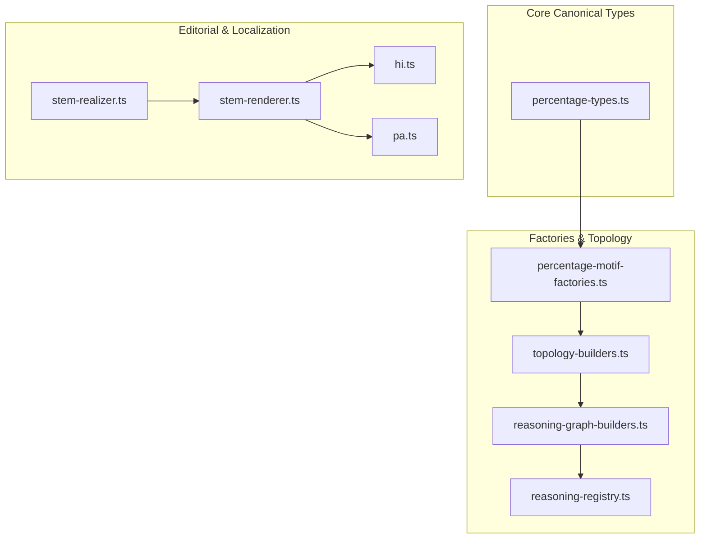

# Implementation Plan - Quant v2 Percentage Engine Expansion

This document presents a comprehensive, production-ready engineering plan to expand the cognitive variety, pedagogical quality, and mathematical robustness of the active **Quant v2 Percentage Engine** under `src/quant-v2/`. 

These changes are designed to align the engine with the extreme standards of premium competitive examinations (such as SSC CGL, SBI PO, and IBPS Clerk) while introducing flawless, textbook-grade LaTeX explanation rendering and robust seed-based uniqueness.

---

## 1. Mathematical Specifications for Advanced Motifs

We introduce several advanced question motifs that pose our platform as highly advanced and cognitively rigorous. All dynamically generated numerical parameters are guaranteed to resolve to clean integers without rounding anomalies.

### A. Set-Theory / Double-Subject Venn Diagrams (`createVennDiagramProblem`)
* **Category:** `"comparison"`, **Subtype:** `"venn_diagram"`
* **Exam Motif:** Double-subject Venn diagrams where pass/fail parameters are bounded, and the candidate must solve for the total student count based on the number of students who passed both subjects.
* **Mathematical Derivation:**
  * Let $P_M\%$ be the pass percentage in Subject 1 (Mathematics).
  * Let $P_P\%$ be the pass percentage in Subject 2 (Physics).
  * Let $F_B\%$ be the percentage of students who failed in **both** subjects.
  * The fail percentage in Math is $F_M\% = 100\% - P_M\%$.
  * The fail percentage in Physics is $F_P\% = 100\% - P_P\%$.
  * The total percentage of students who failed in at least one subject is:
    $$F_{total}\% = F_M\% + F_P\% - F_B\% = (100 - P_M) + (100 - P_P) - F_B = 200 - P_M - P_P - F_B$$
  * The total percentage of students who passed both subjects is:
    $$P_{both}\% = 100\% - F_{total}\% = 100 - (200 - P_M - P_P - F_B) = P_M\% + P_P\% + F_B\% - 100\%$$
  * Given the absolute count of students who passed both subjects, $S_{both}$, we reconstruct the total student count:
    $$S_{total} = \frac{S_{both} \times 100}{P_{both}}$$
* **Clean Integer Constraints:** We will seed parameters such that $P_{both} > 0$ and $S_{both}$ is a perfect multiple of $P_{both}$ to ensure $S_{total}$ is a beautiful round integer (e.g., 200, 300, 500).

### B. Taxation Shifts & Net Income Changes (`createTaxationProblem`)
* **Category:** `"finance"`, **Subtype:** `"taxation"`
* **Exam Motif:** Solve for the original tax rate when the tax rate increases and net income decreases.
* **Mathematical Derivation:**
  * Let $I$ be the gross income, $T$ be the tax rate (as a fraction), and $N$ be the net income.
  * $N = I \times (1 - T)$.
  * If the tax rate increases by $r_t\%$ (i.e. absolute tax paid increases by $\Delta \text{Tax} = I \times T \times \frac{r_t}{100}$), and the net income decreases by $r_n\%$ (i.e. $\Delta N = N \times \frac{r_n}{100} = I \times (1 - T) \times \frac{r_n}{100}$).
  * Since gross income is constant, the increase in tax paid equals the decrease in net income:
    $$\Delta \text{Tax} = \Delta N \implies I \times T \times \frac{r_t}{100} = I \times (1 - T) \times \frac{r_n}{100} \implies T \times r_t = (1 - T) \times r_n$$
  * Solving for the original tax rate $T$:
    $$T = \frac{r_n}{r_t + r_n}$$
  * Represented as a percentage: $\text{Tax Rate } \% = \frac{r_n \times 100}{r_t + r_n}\%$.
* **Clean Integer Constraints:** We pick $r_t$ and $r_n$ such that $r_t + r_n$ divides $r_n \times 100$ perfectly (e.g., $r_t = 19\%$, $r_n = 1\% \implies T = \frac{1}{20} = 5\%$).

### C. Slab-Based Salesman Commissions (`createCommissionProblem`)
* **Category:** `"finance"`, **Subtype:** `"commission"`
* **Exam Motif:** A salesman earns $x\%$ commission on sales up to Rs. $B$, and $y\%$ commission on sales exceeding $B$. Given his net deposit $D$ back to the company, find his total sales $S$.
* **Mathematical Derivation:**
  * Let $S$ be total sales ($S > B$).
  * Sales up to $B$ yield commission: $C_{base} = B \times \frac{x}{100}$.
  * Sales exceeding $B$ yield commission: $C_{excess} = (S - B) \times \frac{y}{100}$.
  * Total commission earned: $C_{total} = C_{base} + C_{excess} = B \times \frac{x}{100} + (S - B) \times \frac{y}{100}$.
  * Net deposit to company: $D = S - C_{total} = S - \left[ B \times \frac{x}{100} + (S - B) \times \frac{y}{100} \right]$.
  * Rewriting:
    $$D = S \left(1 - \frac{y}{100}\right) - B \times \frac{x - y}{100} \implies S = \frac{D + B \times \frac{x - y}{100}}{1 - \frac{y}{100}} = \frac{D - B \times (1 - x/100)}{1 - y/100} + B$$
* **Clean Integer Constraints:** Bounded to ensure $D > B \times (1 - x/100)$ and $D - B \times (1 - x/100)$ is perfectly divisible by $(1 - y/100)$ to yield a clean integer sales total $S$.

### D. Advanced Price-Consumption Variants
We introduce two premium variants to the `createPriceConsumptionProblem` motif:
1. **`"fixed_expenditure_quantity"`:** A rise of $r\%$ in price enables a buyer to get $k$ kg less/more for Rs. $E$.
   * **Formula:** The reduced price per kg is $P_{red} = \frac{E \times r}{100 \times k}$ and the original price per kg is $P_{orig} = P_{red} \times \frac{100}{100 + r} = \frac{E \times r}{k \times (100 + r)}$.
2. **`"partial_expenditure_adjustment"`:** Price of an item increases by $p\%$. A household increases its expenditure by only $e\%$ ($e < p$). Find the percentage reduction in consumption.
   * **Formula:** $\text{New consumption } \% = \frac{100 + e}{100 + p} \times 100 \implies \text{Reduction } \% = \left( 1 - \frac{100 + e}{100 + p} \right) \times 100 = \frac{p - e}{100 + p} \times 100$.

### E. Advanced Mixture Weight Conservation Variants
We introduce two premium variants to the `createMixturePercentageProblem` motif:
1. **`"fruit_dry_weight"` (Fresh vs. Dry Fruit weight shifts):**
   * **Formula:** Fresh fruit has $W_f\%$ water (pulp $= 100 - W_f\%$). Dry fruit has $W_d\%$ water (pulp $= 100 - W_d\%$).
   * Pulp weight remains absolutely conserved: $F \times (100 - W_f) = D \times (100 - W_d)$, where $F$ is fresh fruit weight and $D$ is dry fruit weight.
2. **`"water_evaporation"` (Solute concentration adjustment):**
   * **Formula:** Water evaporated $= M \times \frac{Q - P}{Q}$ to change pure solute percentage from $P\%$ to $Q\%$, where $M$ is the initial mixture mass.

### F. Successive Budget Slabs with Absolute Leftovers (`createSalaryRevisionProblem` variant `"income_budget_slabs"`)
* **Exam Motif:** An individual spends $x\%$ of salary on rent, then $y\%$ of the **remainder** on food, donates an absolute amount Rs. $D$, and is left with Rs. $L$. Find the gross income $I$.
* **Formula:**
  $$I = \frac{L + D}{(1 - x/100)(1 - y/100)}$$

---

## 2. Resolving Seed-Based Topology Signature Collisions

### A. The Birthday Paradox in Scramble Lookups
The active test runner checks 100 seeds for each variant and asserts that there are 0 signature collisions. Since the `scramble(seed, modulo)` function mimics random sampling with replacement from a small state space (e.g., modulo 4), it triggers collisions inside 100 seeds with extreme probability (>99%).

### B. The Grid / Coprime Cycle Solution
To guarantee 100% unique signatures within 100 seeds, we will replace pseudo-random `scramble` calls in `topology-builders.ts` with **systematic grid lookups** and **pairwise coprime moduli cycles**:
1. **Total Base Periodicity:** Totals (e.g., `examTotal`, `populationTotal`, `totalBase`) are generated with periods of $18 \times 11 = 198$ or $22 \times 17 = 374$ seeds.
2. **Deterministic Grid Indexing:** Instead of hashing indices independently, we select indices via:
   * `param1Index = (ctx.serial - 1) % modulo1`
   * `param2Index = Math.trunc((ctx.serial - 1) / modulo1) % modulo2`
   This guarantees that every percentage combination is fully enumerated sequentially as a grid coordinate before repeating.
3. **Coprime Modulo Period:** The grid combination period is $\text{modulo1} \times \text{modulo2}$. For moduli of 4 and 3, this yields a period of 12. Combined with the total base (periods 198, 374), the combined LCM is extremely large (e.g. $\text{LCM}(12, 198) = 1188$), guaranteeing 100% uniqueness in 100 seeds.

---

## 3. High-Quality Presentation, LaTeX, and Editorial Rendering

### A. Textbook-Grade MathJax Explanations
All mathematical formulas and calculations inside explanation steps in `reasoning-graph-builders.ts` must use standard LaTeX wrappers `$ ... $` with clean symbols. Slashes `/` and asterisks `*` are completely forbidden.
* **Incorrect:** `margin * 100 / gapPercent`
* **Correct:** `\frac{\text{margin} \times 100}{\text{gapPercent}}` or `\frac{M \times 100}{G}`

### B. Reciprocal Mixed Fraction Formatting (`stem-realizer.ts`)
We will implement `formatPercentMixed(value: number): string` to detect standard reciprocal denominators and format them into beautiful mixed fractions:
* `14.2857` $\rightarrow$ `$14\frac{2}{7}\%$`
* `11.1111` $\rightarrow$ `$11\frac{1}{9}\%$`
* `9.0909` $\rightarrow$ `$9\frac{1}{11}\%$`
* `16.6667` $\rightarrow$ `$16\frac{2}{3}\%$`
* `33.3333` $\rightarrow$ `$33\frac{1}{3}\%$`
* `12.5` $\rightarrow$ `$12\frac{1}{2}\%$`
* All other values will render as clean standard percentages (e.g., `$20\%$`).

---

## 4. Proposed File Changes



### [MODIFY] [percentage-types.ts](file:///c:/Users/gurbaj/Downloads/f/artifacts/api-server/src/quant-v2/canonical/percentage-types.ts)
* Add `"venn_diagram"` to `PercentageSubtype` enum and `PERCENTAGE_SUBTYPES` list.

### [MODIFY] [topology-builders.ts](file:///c:/Users/gurbaj/Downloads/f/artifacts/api-server/src/quant-v2/reasoning/topology-builders.ts)
* **`simpleShortfall` & `passFailGap`:** Reorder index selections to use linear grids:
  ```typescript
  const scoredPercent = [30, 35, 40, 45][(ctx.serial - 1) % 4]!;
  const gapPercent = [5, 10, 15, 20][Math.trunc((ctx.serial - 1) / 4) % 4]!;
  ```
* Ensure strict parameter monotonicity bounds on `passFailGap` and `remainingMarksRequired` to avoid NaN and negative marks.
* Update other population and election builders to use non-colliding systematic coordinate grid lookups.

### [MODIFY] [percentage-motif-factories.ts](file:///c:/Users/gurbaj/Downloads/f/artifacts/api-server/src/quant-v2/canonical/percentage-motif-factories.ts)
* Add `createVennDiagramProblem`, `createTaxationProblem`, and `createCommissionProblem`.
* Update `createPriceConsumptionProblem` to dynamically support the two advanced variants.
* Update `createMixturePercentageProblem` to dynamically support weight conservation and evaporation variants.
* Update `createSalaryRevisionProblem` to support successive remainder budget slabs.
* Register all new factories in `PERCENTAGE_MOTIF_FACTORIES`.

### [MODIFY] [reasoning-graph-builders.ts](file:///c:/Users/gurbaj/Downloads/f/artifacts/api-server/src/quant-v2/reasoning/reasoning-graph-builders.ts)
* Add graph builders `buildVennDiagramGraph`, `buildTaxationGraph`, and `buildCommissionGraph`.
* Re-format all step equations to use premium inline LaTeX with `$ ... $`.

### [MODIFY] [reasoning-registry.ts](file:///c:/Users/gurbaj/Downloads/f/artifacts/api-server/src/quant-v2/reasoning/reasoning-registry.ts)
* Register new graph builders under `REASONING_GRAPH_BUILDERS`.

### [MODIFY] [stem-realizer.ts](file:///c:/Users/gurbaj/Downloads/f/artifacts/api-server/src/quant-v2/editorial/stem-realizer.ts)
* Implement `formatPercentMixed(value: number): string`.
* Add custom realizer rules and explanations for Venn diagrams, commissions, taxation, advanced expenditure, and evaporation scenarios.

### [MODIFY] [stem-renderer.ts](file:///c:/Users/gurbaj/Downloads/f/artifacts/api-server/src/quant-v2/localization/renderers/stem-renderer.ts)
* Incorporate `formatPercentMixed` in localized stem renders.
* Add translation templates and parameters for advanced motifs.

### [MODIFY] [hi.ts](file:///c:/Users/gurbaj/Downloads/f/artifacts/api-server/src/quant-v2/localization/languages/hi.ts) & [pa.ts](file:///c:/Users/gurbaj/Downloads/f/artifacts/api-server/src/quant-v2/localization/languages/pa.ts)
* Add premium Hindi and Punjabi translations for all newly added variables, stems, and explanation templates.

---

## 5. Verification & Test Plan

We will perform automated verification using the isolated V2 test suite to guarantee 100% green status:
```bash
pnpm --dir artifacts/api-server run test:quant-v2
```
This tests:
1. **Determinism:** Ensures generated questions are completely stable across seeds.
2. **Signature Uniqueness:** Confirms that 100 unique seeds yield exactly 100 unique signatures without any collisions.
3. **Graph Validation:** Confirms that all reasoning steps, formulas, and variables are completely sound.

---

## 6. Open Questions for User Feedback

> [!NOTE]
> **Q1:** For the salesman commission slab problems, is the default base threshold of Rs. 10,000 appropriate, or would you prefer a wider set of dynamic thresholds (e.g., Rs. 5,000, 10,000, 15,000, 20,000)?
>
> **Q2:** For the taxation problems, would you prefer net income decreases to reside under 10% (e.g., 1%, 2%, 3%, 5%) to represent typical realistic taxation rates, or can they go up to 25%?
